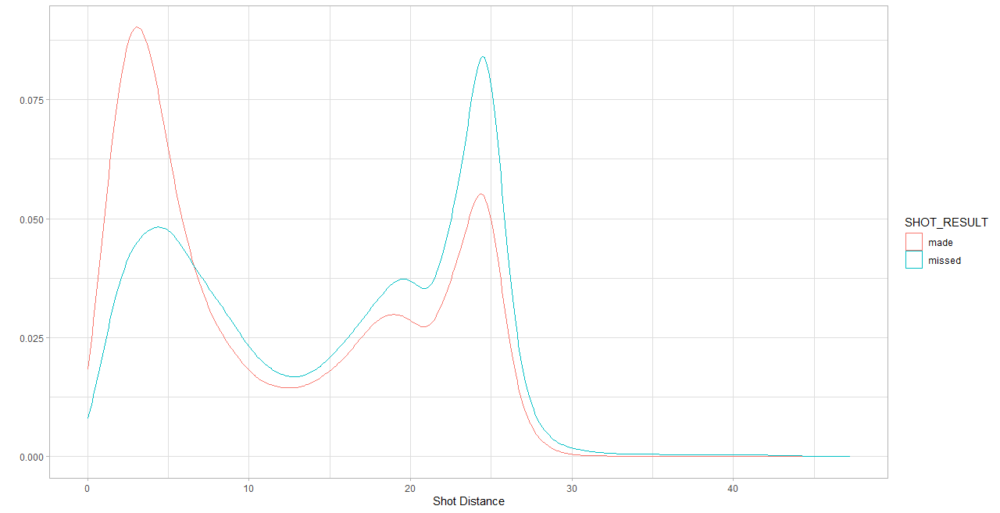

Data analysis of NBA data in 2014 and 2015 seasons. This data has the detailed player shoots against each team with attributes such as closest defender, closest defender distance, dribbles, and touch time.

# Shot Analysis

We compare the top 6 players with best shot accuracy within the dataset. The following is the plot showing it.

<!--  -->

We compare the top 6 players with higgest number of missess or poor shooting.

It is important to analyze the number of shots being scored during every minute of the match. From the bellow plot, it is clear that during the start of every quarter of the match the shots are low and the extra minutes up to 60 have a low number of shots. On the other side, the number of shots towards the end of each quarter is high which can be due to the number of free shots awarded during the last minutes. 

It is easy to argue that as the distance from the target increases the shot accuracy decreases. When the same is plotted on the dataset it proves that the hypothesis is incorrect. In the below graph both made and missed shots are bimodal. It is observed that as distance increase the made shots decrease but tend to increase again where the missed shots peak. This happens around a distance of 24 feet which is the three-pointer line. More attempts are taken around that line with more misses around that region.   

# Report Under work
